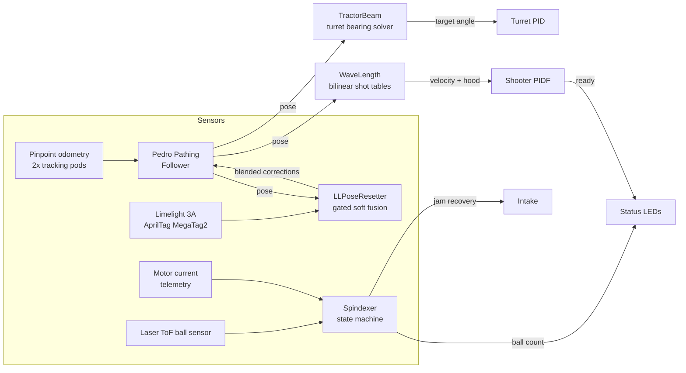

# Penumbra — FTC 11138 Robo Eclipse

**Competition control system for the 2025–26 _FIRST_ Tech Challenge season (DECODE).**
Java on the FTC SDK, built by two students. The repository name decodes as *season* (DECODE) + *event tier* (built for a premier event) + *framework* (Pedro Pathing's Ivy command scheduler).


---

## What this is

FTC robots run on a [REV Control Hub](https://www.revrobotics.com/rev-31-1595/) — an embedded Android device driving motors and servos over a serial hub bus, with no real-time OS, a single-threaded control loop, and every sensor read costing a USB round-trip. Matches alternate a 30-second fully autonomous period with a two-minute driver period, and the same code must run mirrored for the red and blue alliance sides of a 141.5-inch field.

Penumbra plays DECODE by collecting balls ("artifacts") three at a time into a rotating three-slot carousel (the **spindexer**), aiming a continuously rotating **turret** at the goal from anywhere on the field, and firing three-ball volleys through a dual-flywheel **shooter** with a servo-adjustable hood. That means the interesting problems here are the ones that sound easy and aren't:

- **Knowing where the robot is**, continuously, when wheel odometry drifts and the camera occasionally lies.
- **Hitting a goal from arbitrary field positions** with a flywheel whose ballistics resist clean modeling.
- **Moving game pieces through a mechanism that physically jams**, and recovering without human help — including during autonomous, when nobody is allowed to touch the robot.
- **Doing all of it in one thread** at a loop rate the hardware bus actively fights.

Everything below is in [`TeamCode/src/main/java/org/firstinspires/ftc/teamcode`](TeamCode/src/main/java/org/firstinspires/ftc/teamcode).

---

## Architecture



The composition root is [`Robot.java`](TeamCode/src/main/java/org/firstinspires/ftc/teamcode/robot/Robot.java): six subsystems, each exposing a `periodic()` command that owns that subsystem's hardware writes. [`RobotOpMode`](TeamCode/src/main/java/org/firstinspires/ftc/teamcode/robot/RobotOpMode.java) schedules all six periodics once at init; every op-mode — teleop, autonomous, tuning — inherits the identical control core and layers behavior on top by scheduling *more* commands, never by writing to hardware directly.

### The scheduler, used deliberately

The Ivy command framework (Pedro Pathing's scheduler) provides composable commands — `instant`, `waitUntil`, `deadline`, `raceWith`, sequential/parallel groups — with **per-command resource claims** (`.requiring(motor)`) and **priorities**. This codebase leans on both in ways that matter:

- **Priority isolation.** An autonomous routine is one long `Sequential` holding the intake and spindexer motors for its entire run. The spindexer's own periodic can schedule recovery actions that claim the same motors; at equal priority those would *preempt and kill the routine mid-match*. Every auto therefore runs at `AUTO_PRIORITY = 1`, so a periodic-scheduled command is blocked instead of the auto being cancelled.
- **Scheduler bypass where the scheduler is the problem.** Priority isolation creates its own trap: now a *scheduled* jam-recovery command is the thing that gets blocked, and a jammed robot would grind against the obstruction for the rest of autonomous. Recovery is therefore **driven directly** — [`Intake.requestJamReverse()`](TeamCode/src/main/java/org/firstinspires/ftc/teamcode/subsystems/Intake.java) sets a time-window flag that the intake's periodic honors *regardless of command state*, so jam recovery fires under any priority regime, in auto and teleop alike. The periodics own the actual motor writes anyway; the flag is the escape hatch that keeps arbitration from overriding physics.
- **Bounded everything.** Every wait in every autonomous is a race: against a condition, against the path follower's parametric end, and against a timeout. There is no unbounded `waitUntil` anywhere in a competition routine — a follower that never settles, a flywheel that never quite reaches tolerance, or a stuck spindexer each cost bounded time, never the match.
- **A framework trap, documented in place.** The library's `Command.NOOP` reports `done()` as a constant `false`, so using it as the "else" arm of a conditional makes the enclosing `Sequential` wait on it *forever* — an autonomous that silently parks itself whenever the ball count came up short. Both competition autos define a local `noOp()` that actually completes (`instant(() -> {})`) and carry a comment explaining why, so the trap can't be re-stepped-in.

Structurally this is one control loop with **no threads, no locks, and no allocation-heavy work on the hot path** — command composition, not concurrency, is what buys the parallelism. `deadline(driveCommand, throttleController)` runs a supervisory controller *alongside* a path follow and ends it with the follow; `raceWith` gives every blocking wait an escape hatch. The behavior is declarative enough to read off the page and still compiles down to plain sequential calls in one thread.

### Fighting the hardware bus

All hub I/O runs in `MANUAL` bulk-cache mode: the cache is invalidated exactly once at the top of each loop, so the first read triggers one bulk transaction per hub and every subsequent encoder/velocity/digital read that loop is served from the snapshot. (Motor *current* is the exception — it is not in the bulk packet, so the code keeps current reads to one per loop.) The loop overlays an exponentially smoothed loop-time HUD on the driver station so regressions in loop rate are visible the moment they're introduced.

---

## Localization: odometry + gated vision fusion

Dead-reckoning comes from a goBILDA Pinpoint with two unpowered tracking pods, consumed by the Pedro Pathing follower. Odometry drifts; the correction comes from a Limelight 3A running AprilTag **MegaTag2**, which resolves a full field pose given the robot's yaw. The fusion layer, [`LLPoseResetter`](TeamCode/src/main/java/org/firstinspires/ftc/teamcode/math/LLPoseResetter.java), treats the camera as a witness to be cross-examined, not an oracle:

1. **Yaw feeding.** MegaTag2 is only as good as the heading it's given, so the robot's live yaw (converted from Pedro's coordinate frame to the FTC field frame) is streamed to the camera *every loop*, not just at reset time.
2. **Velocity gate** — corrections only apply below 8 in/s. At that speed and ~150 ms camera latency, motion-induced pose error stays near an inch. The drivetrain's velocity estimator deliberately drops its sample whenever the pose is programmatically set, so a fusion correction (a pose "teleport") can never masquerade as motion and trip the gate that regulates it.
3. **Plausibility gates** — a camera pose more than 30 in from odometry, or disagreeing in heading by more than 25°, is rejected outright. These bounds specifically target the two failure signatures of perspective-n-point pose solving: the wrong-solution ambiguity (typically 36–60 in of position error) and the flipped solution (~60° of heading error).
4. **Consensus** — three consecutive frames must pass every gate before any correction fires (~200 ms at the camera's 15 Hz).
5. **Frame-rate-independent blending.** Accepted corrections are applied as an exponential pull toward the camera: `alpha = 1 − e^(−dt/τ)` with τ = 1 s, computed from *camera-frame* timestamps. Two properties fall out of that formula: the real-world convergence speed is invariant to camera FPS (retuning the vision pipeline can't silently make fusion more aggressive), and camera noise manifests as slow drift rather than aim-destroying jumps.
6. **Per-frame deduplication.** The control loop runs ~3× faster than the camera. Without deduplicating on the Limelight's frame timestamp, one camera frame would be blended three or four times and the gentle pull would compound into a near-snap onto a single noisy measurement.

A driver-triggered **hard reset** path bypasses the blend for when the camera has a clean tag view, still guarded by its own distance/heading sanity bounds — and teleop additionally maps two *chorded* (two-button) relocalizations to known field features, so a single accidental button press can never teleport the pose.

---

## The shooting stack

Scoring is a chain of four cooperating solvers, all downstream of the pose estimate.

### WaveLength: measured interpolation over modeled ballistics

Flywheel exit dynamics with compliant foam balls — spin, compression, hood friction — resist first-principles modeling. Instead of a ballistic model, [`WaveLength`](TeamCode/src/main/java/org/firstinspires/ftc/teamcode/math/WaveLength.java) holds **empirically measured 2-D lookup tables**: flywheel velocity and hood position sampled on a grid of field positions (a 3×2 grid for the far launch zone, 3×4 for the close zone), evaluated with bilinear interpolation ([Smile](https://haifengl.github.io/)'s `BilinearInterpolation`) and clamped to the table hull. The zone boundary selects between table pairs automatically; red-alliance positions are mirrored into the blue-authored frame before lookup so one set of measurements serves both sides. The tables are populated on a real field by a dedicated tuning op-mode (below) — data collection is a first-class workflow, not an afterthought.

### TractorBeam + TurretLocation: aiming from where the turret actually is

The turret is not at the robot's center. [`TurretLocation`](TeamCode/src/main/java/org/firstinspires/ftc/teamcode/math/TurretLocation.java) rotates the turret's lever-arm offset through the chassis heading to get the turret's true field position; [`TractorBeam`](TeamCode/src/main/java/org/firstinspires/ftc/teamcode/math/TractorBeam.java) then solves the goal bearing from *that* point, normalizes it into the turret's frame, applies a tunable aim-offset term, and clips to the turret's travel. The interpolation tables are likewise queried at the turret's position, not the robot's — at close range those inches matter.

### Turret: a servo turned into a precision axis

The turret is driven by a continuous-rotation servo — mechanically simple, but positionless. Position feedback comes from an 8192 CPR through-bore encoder read through a **repurposed drive-motor encoder port**: the drive motors run open-loop (localization comes from the Pinpoint pods), so their encoder ports were free, and the hub's port budget stretches two sensors further than it was designed to. Through the 45:102 gearing that yields ~18,570 ticks per turret revolution — about **0.02° of resolution**.

On top of that sits a full PID with the guards a match environment demands: integral clamping, derivative clamping, a deadband that resets the controller at target (so it can't hunt against static friction), a static-friction feedforward term, `dt` sanity bounds against loop stalls, soft travel limits enforced at the power level (−175° to +90°), and hard power caps. The turret's absolute angle survives the transition between autonomous and teleop via a static angle-transfer channel, so the driver period starts already localized and aimed.

### Shooter: custom PIDF on raw motor power

Flywheel velocity control uses a hand-rolled PIDF — proportional/integral/derivative on velocity error plus `kV · target` and a signed static term — written against raw motor power rather than the SDK's onboard velocity PID, keeping the control law fully visible and tunable from the dashboard. Readiness (`atTarget()`) requires *both* flywheel velocity and hood position inside tolerance; that single predicate gates shots in autonomous, the driver's fire control, and the status LEDs, so every part of the system agrees on what "ready" means. A small latch (`hoodActive`) keeps the hood servo un-commanded until the shooter is first used, so init can't slam the hood to its minimum while the robot is being handled.

---

## The spindexer: indexing under adversarial physics

The spindexer is where the codebase earns its keep. Three slots on a 120° pitch, driven by a motor and tracked by a second 8192 CPR external encoder (on another borrowed drive-motor port), with a laser time-of-flight ball sensor at the intake mouth. Everything below runs inside one `periodic()` — every loop, in one thread, off one bulk read.

**Slot-quantized position control.** Rotations don't accumulate error: each indexing move computes the nearest 120° lattice point from the *current* position and targets an adjacent slot, so mechanical slips and nudges are absorbed instead of compounding. A manual-offset channel lets the operator trim alignment mid-match, with the lattice math applied on top of the un-trimmed frame. The position PID carries a **static "detent-breaking" feedforward** applied only while outside the deadband — enough constant push to break past the mechanism's resistance on every move, guaranteed inactive at rest so it can never cause hunting. Around the loop sit a hold-correction band (small disturbances get corrected, encoder jitter doesn't), a settle latch, and a move timeout that restarts a stalled controller.

**Autonomous indexing.** When the ball sensor fires, the spindexer queues an advance to present the next empty slot — but only through a stack of guards developed against real failure modes: an **arming latch** requires the sensor to clear between balls (a ball still transiting the sensor cannot trigger a second advance and push an empty slot through), a debounce anchors to the moment the *rotation actually finishes* rather than when it was commanded, and a global rotation lockout paces both automatic and manual advances. The count tops out at three, at which point intaking self-disarms and a wedged fourth ball is actively spat back out.

**Jam detection as a current-signature taxonomy.** Motor current is the one honest sensor a jam can't hide from. The periodic classifies jams into five distinct signatures, each with its own thresholds and response:

| Signature | Detection | Response |
|---|---|---|
| **Normal jam** | Intake current ≥ 4 A sustained 160 ms while *nothing* is being handled (spindexer idle, no ball at sensor) | Reverse intake, advance a slot, count the freed ball |
| **Hard jam** | Current high ≥ 500 ms even while the indexing path *looks* busy | Same — the normal path clearly isn't clearing it |
| **Full-capacity jam** | 3 balls seated and intake still running | Eagerly reverse — a 4th ball has nowhere to go |
| **Shooting jam** | Sustained current mid-volley | Reverse intake only; never disturb the spindexer or count |
| **Mid-rotation strain** | *Spindexer* current > 3 A sustained 200 ms during an indexing turn | Reverse intake to relieve the wedged ball |

The current comparators use **hysteresis** (trigger at 4 A, keep timing until it releases below 3 A) so noise at the threshold can't reset the sustain timers, and the "is a ball being handled" guard exists because a *normal* ball load also spikes current — without it, jam recovery would fight every legitimate intake. All five signatures funnel into one shared, cooldown-guarded response, and the response is delivered through the direct-drive path described above so it works even while an autonomous command chain owns the motors.

**Volley mechanics.** Firing rotates the carousel a full revolution plus one slot (~480°) in the shooting direction so every seated ball is pushed through. In autonomous the spindexer additionally suppresses ball detection until that rotation *measurably completes* (by encoder position, not by timer), so the sensor can't count the robot's own outgoing balls as new intake — then re-arms fresh.

The [intake](TeamCode/src/main/java/org/firstinspires/ftc/teamcode/subsystems/Intake.java) cooperates: its feed servo tracks the spindexer's actual motion — outward while the carousel indexes (with a 300 ms coast after the turn), inward while intaking or firing, and *never* inward during a jam reverse, where it would fight the recovery.

**Status LEDs** close the loop with the humans: PWM-driven RGB indicators encode ball count (red/orange/blue/green for 0–3) and collapse to distinct "ready" colors when the shooter is at speed — with the servo PWM range explicitly pinned to the standard 600–2400 µs so every value lands on its intended color from the manufacturer's chart rather than drifting with the SDK's default range. Both gamepads get the same information tactilely: rumble cues for ready-to-shoot, full spindexer, and rejected inputs.

---

## Autonomous

Three routines share the abstract-base + alliance-wrapper pattern: coordinates are authored once for blue, and a `pose()/hdg()` layer mirrors across the field centerline for red — with deliberate, documented *asymmetries* on top (per-side aim biases, an explicit red start pose, a red-only corner reach shift) because a mirrored world is not quite a symmetric one: the turret's travel limits and shot geometry don't mirror with it.

**[`GateIntakeWithFarAuto`](TeamCode/src/main/java/org/firstinspires/ftc/teamcode/opmode/GateIntakeWithFarAuto.java)** — the flagship: preload, a curved row sweep, two cycles through the field gate, a final row sweep, and park. Its interesting machinery:

- **Pre-aim / live-correct split.** While driving, the turret aims at the *fixed upcoming shoot pose* instead of tracking the live pose — so it holds steady rather than swinging with every path correction — then switches to live aim inside 3 in of the shot, where the correction is small and fast.
- **Approach spin-up latch.** Inside 20 in of a shoot pose the flywheel target latches to the interpolated *shoot-pose* value rather than chasing the still-rising live interpolation, arriving at speed instead of settling after arrival. The latched value is the same one the shot will use, so accuracy is unchanged — only the dead time is removed.
- **Compound shot gating.** A volley fires only when flywheel ∧ position ∧ turret alignment all hold (tolerances: at-speed, ≤5 in — tightened to 2 in for gate shots, ≤2°), raced against a timeout so the routine always advances.
- **Ball-aware gate exits.** At the gate: leave instantly at 3 balls, 300 ms after reaching 2, or on a 950 ms fallback with 0–1 — under a 2 s hard cap. The robot spends exactly as long at the gate as the balls justify.
- **Zone-based throttling.** Drive power is modulated *by field position* inside a `deadline` running alongside the path follow — slow through the ball rows so the intake can seat what it sweeps, full speed elsewhere — rather than by splitting paths, which would cost a follower deceleration at every seam.

**[`FarZoneAuto`](TeamCode/src/main/java/org/firstinspires/ftc/teamcode/opmode/FarZoneAuto.java)** — fires the preload from a standstill, sweeps the far row, then loops the corner stack with a rounded U-turn profile that flows through collection without nose-in reversals. It adds a chassis-heading settle gate before firing (the fixed turret pre-aim is only correct once the chassis has finished turning onto the shoot heading), an eject-then-shoot ending that reverses the intake *in parallel with* the readiness settle (costing `max(eject, settle)` instead of their sum), and a direction-aware corner throttle that detects inward travel from the authored-frame x-delta — with a 0.05 in epsilon so pose jitter at the turnaround can't flicker the drive power.

**[`AutoCloseNoGateFallBack`](TeamCode/src/main/java/org/firstinspires/ftc/teamcode/opmode/AutoCloseNoGateFallBack.java)** — the team's previous-generation close auto, ported from an FTCLib/CommandScheduler codebase onto Ivy + Pedro and kept race-ready as a strategic fallback when the gate is contested.

Between periods, nothing is thrown away: final pose, turret angle, and alliance all carry into teleop through static transfer channels, so the driver period begins with the robot still knowing exactly where it is and where the goal is.

### Pathing

Paths are authored as Bézier chains with explicit heading interpolation modes per segment (tangent, reversed-tangent, constant, linear), against a Pedro follower configured with predictive braking coefficients and tuned primary/secondary heading PIDFs. Two habits stand out: path seams are constructed so the entering tangent of one segment equals the exit tangent of the last (no turn at the joint), and geometry revisions shift Bézier *control points together with their endpoints* to preserve approach tangents — the shape of an arrival is treated as part of the tuned system. Every follow races the follower's parametric end, advancing the routine the instant the robot arrives rather than waiting out the follower's settle.

---

## Teleop

[`TeleOp_Solo`](TeamCode/src/main/java/org/firstinspires/ftc/teamcode/opmode/TeleOp_Solo.java) starts input-locked (a deliberate Start press arms it — no twitching robots during field reset), then runs field-centric mecanum drive with squared stick response, continuous MegaTag2 fusion, and full-time turret auto-aim with an operator trim channel layered on top: step-nudges for walking a volley onto target, one button to zero back to the pure solution.

Stick input is shaped with a **signed square** (`sign(x)·x²`), trading resolution at full deflection for fine control near center — mecanum strafe is twitchy enough that a linear map costs precision exactly where the driver is lining up a shot. The heading-lock controller runs its error through `normalizeRadians` before the PIDF, so a lock across the ±π wrap takes the short way around instead of unwinding a full rotation, and any deliberate turn-stick input releases the lock instantly rather than fighting it.

The interaction design assumes gloves and adrenaline: destructive or rare actions (pose relocalizations) require two-button chords; manual spindexer indexing is lockout-protected and *rejections are rumbled* so the operator knows the input was seen and refused rather than dropped; filling to three balls automatically warns, holds off the intake, and spits back the inevitable fourth ball — then re-arms itself when the count drops.

---

## Tuning as infrastructure

The interpolation tables are only as good as the data collection, so the repo treats tuning as a product:

- **[`ShooterInterpolationTuning`](TeamCode/src/main/java/org/firstinspires/ftc/teamcode/opmode/ShooterInterpolationTuning.java)** walks the operator through all 18 grid points of both WaveLength tables: it displays drive-to coordinates for the selected point (index-mirrored for red so the *physical* walk order matches the table order), lets the operator dial velocity and hood live while shooting, and records the pair per point — telemetry prints the exact Java table entry to transcribe. Point selection, steps, and saves are all also exposed through dashboard variables, so a laptop can drive the session.
- **[`TurretTest`](TeamCode/src/main/java/org/firstinspires/ftc/teamcode/opmode/TurretTest.java)** isolates the turret/shooter/indexer chain for bring-up.
- Every constant in [`util/Constants.java`](TeamCode/src/main/java/org/firstinspires/ftc/teamcode/util/Constants.java) is live-tunable from [Panels](https://panels.bylazar.com/) or FTC Dashboard mid-run — and the file is heavily annotated with *which knob to turn for which symptom*, effectively a tuning runbook embedded in the constants.
- A field overlay draws the live pose on the dashboard field view; the loop-time HUD keeps the control rate honest.

---

## Hardware

| Function | Hardware | Control |
|---|---|---|
| Drive | 4× mecanum, brushed DC | Pedro follower / field-centric teleop, open-loop |
| Localization | goBILDA Pinpoint + 2 tracking pods | Pedro localizer |
| Vision | Limelight 3A | AprilTag MegaTag2, 1280×960 @ 40 fps pipeline |
| Turret | CR servo + 8192 CPR through-bore encoder (45:102) | Custom PID, ~0.02°/tick |
| Shooter | 2× flywheel motors + hood servo | Custom velocity PIDF + interpolated targets |
| Spindexer | DC motor + 8192 CPR external encoder | Slot-quantized position PID + detent feedforward |
| Ball detection | Laser ToF sensor (digital) | Debounced/armed indexing trigger |
| Intake | DC motor + CR feed servo | Mode machine + jam-reverse windows |
| Driver feedback | 2× PWM RGB LEDs, gamepad rumble/LEDs | State-encoded |

Both external encoders ride on drive-motor encoder ports — free because localization comes from the odometry pods, not the wheels.

## Details worth knowing

A few decisions that don't fit above but say something about how the system is built:

- **Every controller is defensive about `dt`.** All four hand-written loops (turret, flywheel, spindexer position, plus the velocity estimator) clamp their measured timestep and substitute a nominal 20 ms if it comes back non-positive or absurdly large. A garbage-collection pause or a slow hub transaction therefore produces a slightly stale correction, never a derivative spike that slams a mechanism.
- **Integral windup is bounded everywhere**, per-loop, at values tuned to each mechanism's authority — and the turret additionally *resets* its integrator on entering the deadband, so it never accumulates a bias while sitting on target.
- **Degrees at the boundary, radians inside.** Pedro works in radians, the FTC field frame reports degrees, and the tuning constants are authored in degrees because that's what humans measure with. Conversions are pinned to exactly one layer and applied explicitly at every call site — `Math.toRadians` at construction, `Math.toDegrees` at telemetry — so the unit of any value is readable from the line it appears on rather than inferred from context.
- **Coordinate frames are converted explicitly, not assumed.** The vision layer moves poses between Pedro's frame and the FTC field frame through the library's `getAsCoordinateSystem` in both directions rather than hand-rolling sign flips, which is why the yaw feed and the returned botpose agree.
- **Alliance mirroring is one function, applied consistently.** `pose()`, `point()`, and `hdg()` mirror authored-blue geometry across the field centerline; every deliberate red-side deviation is a *named constant* layered on top (`RED_CORNER_X_SHIFT`, `RED_FIRST_SHOT_EXTRA_DEGREES`, …) rather than a forked code path — so the asymmetries are enumerable and tunable instead of hidden in a branch.
- **Graceful degradation on missing hardware.** The unwired "ready" LED is fetched through a `try` that tolerates its absence, and its state is folded onto the working count LED instead — the robot runs a configuration short of a device rather than throwing at init, which on a competition field is the difference between a match and a no-show.
- **The tuning op-mode mirrors its *index order*, not just its coordinates**, so on the red side the operator physically walks the field in the same order the table is laid out — a small thing that stops transcription errors when you're kneeling on a field with 18 measurements to take.

## Repository layout

```
TeamCode/src/main/java/org/firstinspires/ftc/teamcode/
├── robot/          Robot (composition root), RobotOpMode (loop core), Alliance
├── subsystems/     Drivetrain, Turret, Shooter, Spindexer, Intake, Leds
├── math/           WaveLength, TractorBeam, TurretLocation, LLPoseResetter, PoseMirror
├── opmode/         TeleOp_Solo, GateIntakeWithFar*, FarZone*, AutoCloseNoGateFallBack*,
│                   ShooterInterpolationTuning, TurretTest
├── pedroPathing/   Follower constants + tuning opmodes
└── util/           Constants (live-tunable), HardwareNames, PanelsFieldDrawing
```

## Building

Standard FTC SDK Android project: clone, open in Android Studio (Ladybug+), and deploy the `TeamCode` module to a REV Control Hub over ADB/Wi-Fi. Device names expected in the robot configuration are centralized in [`HardwareNames.java`](TeamCode/src/main/java/org/firstinspires/ftc/teamcode/util/HardwareNames.java).

| Dependency | Version | Role |
|---|---|---|
| FTC SDK | 11.1.0 | Platform |
| Pedro Pathing | 2.1.2 | Path following + localization |
| Pedro Ivy | 1.0.0 | Command scheduler |
| Panels (bylazar) | 1.0.12 | Live config + field view |
| ACME Dashboard | 0.5.1 | Telemetry/graphing |
| Smile (interpolation) | 2.6.0 | Bilinear table interpolation |

## Team

Penumbra is built by **FTC Team 11138 Robo Eclipse**. Software by [Anish Agrawal](https://github.com/anish-agr) and [Aarush Kikkuru](https://github.com/aarushkik).
